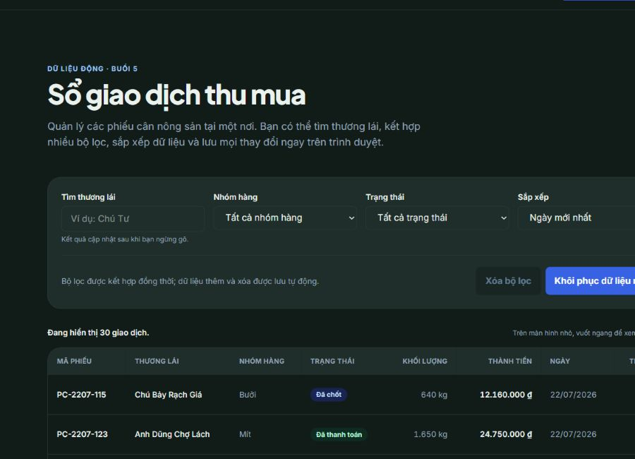

# Landwind — Phần mềm quản lý thu mua

Bài thực hành Thiết kế Web của **Tài — MSSV 2551050196**, xây dựng bằng HTML, Tailwind CSS và JavaScript thuần.

## Liên kết

- Demo: [GitHub Pages](https://2551050196tai-boop.github.io/tkw_2551050196_Tai/)
- Trang dữ liệu Buổi 5: [Sổ giao dịch](https://2551050196tai-boop.github.io/tkw_2551050196_Tai/records.html)
- Kho mã nguồn: [GitHub](https://github.com/2551050196tai-boop/tkw_2551050196_Tai)
- Figma: chưa có URL Figma trong tài liệu bàn giao hoặc lịch sử kho mã; cần bổ sung link thiết kế gốc khi có.

## Ảnh minh họa



## Tính năng chính

- Giao diện responsive, hỗ trợ dark mode, menu bàn phím, FAQ, slider, bảng giá theo tháng/năm và nút lên đầu trang.
- Trang `records.html` tải 30 giao dịch từ `data/records.json` và quản lý dữ liệu theo mô hình **state → render**.
- Có đủ bốn trạng thái giao diện: đang tải, sẵn sàng, rỗng và lỗi có nút thử lại.
- Tìm thương lái có debounce 300 ms và hỗ trợ tìm không dấu; bộ lọc nhóm hàng, trạng thái và sắp xếp được kết hợp đồng thời.
- Thêm, xóa, khôi phục dữ liệu mẫu và lưu thay đổi trong `localStorage` bằng cấu trúc có phiên bản.
- Dữ liệu người dùng được dựng bằng `<template>` và `textContent`; không đưa dữ liệu động vào `innerHTML`.
- Form liên hệ dùng Constraint Validation API, báo lỗi tiếng Việt, cập nhật `aria-invalid`, tập trung vào trường lỗi đầu tiên và hiển thị thông báo thành công.
- Bảng dữ liệu có caption, tiêu đề cột, vùng cuộn ngang trên màn hình nhỏ và các live region hỗ trợ trình đọc màn hình.

## Các trang trong dự án

1. `index.html`: trang chủ giới thiệu giải pháp, tính năng, cảm nhận, thống kê, bảng giá, FAQ và CTA.
2. `product.html`: giới thiệu chi tiết sản phẩm.
3. `pricing.html` và `price.html`: bảng giá, công tắc tháng/năm và nội dung so sánh.
4. `documents.html`: trung tâm tài liệu và hỗ trợ.
5. `contact.html`: form đăng ký tư vấn có validation tùy chỉnh.
6. `records.html`: sổ giao dịch động của Buổi 5.

## Chạy dự án

Yêu cầu Node.js và npm. Không mở `records.html` trực tiếp bằng giao thức `file://` vì trình duyệt cần HTTP để tải JSON.

```bash
npm install
npm run build
npx serve .
```

Sau đó mở `http://localhost:3000/records.html`. Khi chỉnh class Tailwind, chạy thêm lệnh sau ở một terminal khác:

```bash
npm run dev
```

## Kiểm tra chất lượng

Lighthouse mobile chạy cục bộ ngày 24/08/2026:

- `records.html`: Performance **100**, Accessibility **100**.
- `contact.html`: Performance **91**, Accessibility **100**.

Các luồng tìm kiếm, kết hợp bộ lọc/sắp xếp, trạng thái rỗng, thêm và lưu lại sau khi tải trang, validation lỗi/thành công cũng đã được kiểm tra trực tiếp trên trình duyệt. Console không có lỗi hoặc cảnh báo.

## Design tokens

| Vai trò | Token | Giá trị mặc định |
|---|---|---|
| Màu thương hiệu | `--color-brand-600` | `#2563eb` |
| Màu nhấn | `--color-accent-500` | `#3b82f6` |
| Chữ chính | `--color-ink` | `#0f172a` |
| Chữ phụ | `--color-muted` | `#475569` |
| Nền trang | `--color-surface` | `#ffffff` |
| Nền phụ | `--color-surface-alt` | `#f1f5f9` |
| Viền | `--color-line` | `#cbd5e1` |
| Phông tiêu đề | `--font-display` | Plus Jakarta Sans |
| Phông nội dung | `--font-body` | Inter |
| Bo góc thẻ | `--radius-card` | `24px` |

Các breakpoint Tailwind chính: `sm` 640 px, `md` 768 px, `lg` 1024 px, `xl` 1280 px và `2xl` 1536 px.

## Ba điều sẽ làm thêm nếu có thời gian

1. Bổ sung kiểm thử tự động cho chuỗi tìm kiếm, lọc, sắp xếp, thêm/xóa và quá trình khôi phục dữ liệu.
2. Đồng bộ giao dịch với API có xác thực thay vì chỉ lưu cục bộ trong trình duyệt.
3. Thêm phân trang, nhập/xuất CSV và biểu đồ tổng hợp theo ngày, nhóm hàng và trạng thái.

## Phát hành Buổi 5

- Nhánh làm bài: `buoi-5`.
- Tag phát hành: `buoi-5`.
- CSS production được tạo bằng `npm run build` tại `dist/output.css`.
